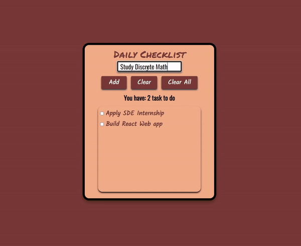

<h1 > Daily Checklist - WebApp </h1>
<h2> AUTHOR: LE THIEN AN TRAN </h2>

<h3> ABOUT IT </h3> 

This is a simple web app build with React and Tailwind CSS that you can create a checklist. My goal when doing this is to practice building and deploying REACT app for further knowledge. You can view it through the following URL:

https://dailychecklist-lethienantran.netlify.app/

<h3> FEATURES </h3> 
<ul>
<li> Create a list </li>
<li> Check/uncheck items </li> 
<li> Clear and delete items </li> 
</ul>
<h3> TOOLS </h3>
<ul>
<li> React </li>
<li> Tailwind CSS </li>
<li> Visual Studio 2022 </li> 
</ul>
